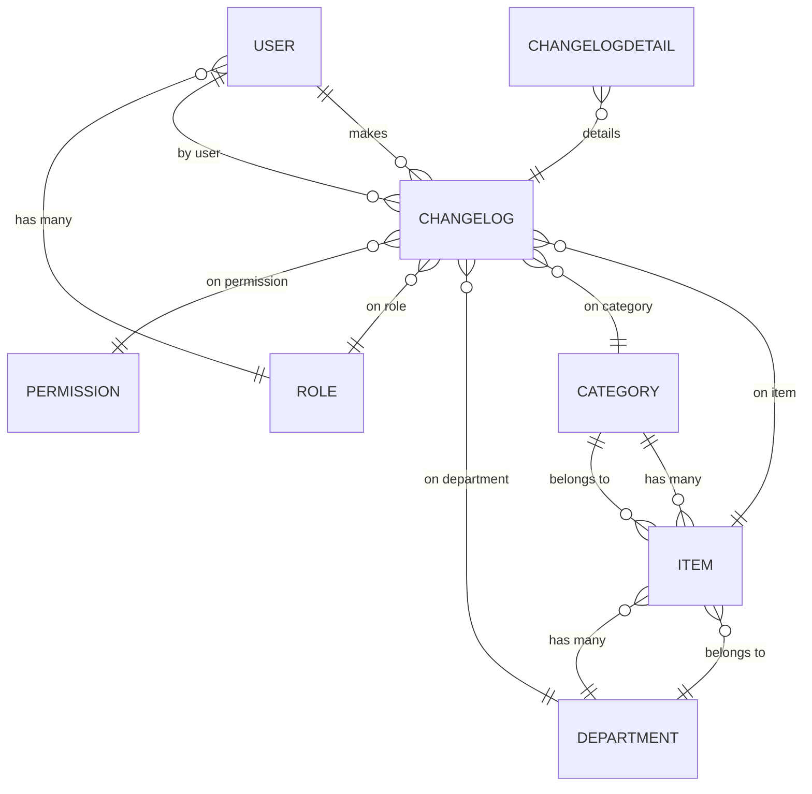

# Inventory Manager – Backend

## Overview

This backend (Node.js, Express, TypeScript, Sequelize) powers the Inventory Manager, providing robust inventory, category, and department management with a relational PostgreSQL database.

## Models & Relations

### Implemented Models

#### **Item**

- `id`: integer, PK, auto-increment
- `name`: string, required, unique
- `quantity`: integer, required, default 1
- `unit`: enum (`und.`, `kg`, `l`, `m`), required, default `und.`
- `creationDate`: datetime, auto
- `updatedOn`: datetime, auto
- `deletionDate`: datetime, nullable
- `categoryId`: FK to Category, nullable
- `departmentId`: FK to Department, required
- **Hooks**: Automatically logs changes on create, update, and delete operations.

#### **Category**

- `id`: integer, PK, auto-increment
- `name`: string, required, unique
- `creationDate`: datetime, auto
- `updatedOn`: datetime, auto
- `deletionDate`: datetime, nullable
- **Hooks**: Automatically logs changes on create, update, and delete operations. Prevents deletion if items are assigned.

#### **Department**

- `id`: integer, PK, auto-increment
- `name`: string, required, unique
- `creationDate`: datetime, auto
- `updatedOn`: datetime, auto
- `deletionDate`: datetime, nullable
- **Hooks**: Automatically logs changes on create, update, and delete operations. Prevents deletion if items are assigned.

#### **User**

- `id`: integer, PK, auto-increment
- `username`: string, required, unique
- `passwordHash`: string, required (excluded by default in queries)
- `roles`: many-to-many relationship with Role
- `creationDate`: datetime, auto
- `updatedOn`: datetime, auto
- `deletionDate`: datetime, nullable
- **Hooks**: Automatically logs changes on create, update, and delete operations. Passwords are hashed before saving.

#### **Role**

- `id`: integer, PK, auto-increment
- `name`: string, required, unique
- `description`: string, optional
- `users`: many-to-many relationship with User
- `creationDate`: datetime, auto
- `updatedOn`: datetime, auto
- `deletionDate`: datetime, nullable
- **Hooks**: Automatically logs changes on create, update, and delete operations.

#### **Permission**

- `id`: integer, PK, auto-increment
- `name`: string, required, unique
- `description`: string, required
- `deletionDate`: datetime, nullable
- **Hooks**: Automatically logs changes on create, update, and delete operations.

#### **ChangeLog**

- `id`: integer, PK, auto-increment
- `operation`: enum (`create`, `update`, `delete`, `link`, `unlink`)
- `changeDetails`: JSON, optional
- `changedAt`: datetime, auto
- `changedBy`: FK to User, required
- **Associations**: Belongs to User, Item, Category, Department, Role, Permission.

#### **ChangeLogDetail**

- `id`: integer, PK, auto-increment
- `changeLogId`: FK to ChangeLog, required
- `field`: string, required
- `oldValue`: JSON, optional
- `newValue`: JSON, optional
- `metadata`: JSON, optional
- `diffType`: enum (`added`, `changed`, `removed`), required

### Relations

- **Item** belongs to **Category** (nullable)
- **Item** belongs to **Department** (required)
- **Category** has many **Items**
- **Department** has many **Items**
- **User** has many **ChangeLogs**
- **Role** has many **Users** (many-to-many)
- **ChangeLog** belongs to **User**, **Item**, **Category**, **Department**, **Role**, **Permission**
- **ChangeLogDetail** belongs to **ChangeLog**

### Hooks

- **Entity Hooks**: Each model includes hooks to automatically log changes to the `ChangeLog` and `ChangeLogDetail` tables. This includes operations such as create, update, delete, link, and unlink.
- **Password Hashing**: The `User` model hashes passwords before saving them to the database.

## ERD Diagram

## Controllers

The backend includes several controllers to manage different aspects of the application. Each controller provides methods for creating, retrieving, updating, and deleting entities, as well as handling pagination and validation.

### ChangeLogController

- **Purpose**: Manages retrieval of change logs for various entities.
- **Methods**:
  - `getChangeLogsByCategoryId(categoryId, { page, pageSize })`: Retrieves change logs for a specific category.
  - `getChangeLogsByItemId(itemId, { page, pageSize })`: Retrieves change logs for a specific item.
  - `getChangeLogsByDepartmentId(departmentId, { page, pageSize })`: Retrieves change logs for a specific department.
  - `getChangeLogsByUserId(userId, { page, pageSize })`: Retrieves change logs for a specific user.

### ItemController

- **Purpose**: Manages operations related to items.
- **Methods**:
  - `createItem(name, departmentId, userId, quantity, unit, categoryId)`: Creates a new item.
  - `getItemById(itemId)`: Retrieves an item by its ID.
  - `getAllItems({ page, pageSize })`: Retrieves all items with pagination.
  - `updateItem(itemId, updates, actionUserId)`: Updates an existing item.
  - `deleteItem(itemId, actionUserId)`: Deletes an item.

### DepartmentController

- **Purpose**: Manages operations related to departments.
- **Methods**:
  - `createDepartment(name, userId)`: Creates a new department.
  - `getDepartmentById(departmentId)`: Retrieves a department by its ID.
  - `getAllDepartments({ page, pageSize })`: Retrieves all departments with pagination.
  - `updateDepartment(departmentId, updates, actionUserId)`: Updates an existing department.
  - `deleteDepartment(departmentId, actionUserId)`: Deletes a department, ensuring no items are assigned.

### CategoryController

- **Purpose**: Manages operations related to categories.
- **Methods**:
  - `createCategory(name, userId)`: Creates a new category.
  - `getCategoryById(categoryId)`: Retrieves a category by its ID.
  - `getAllCategories({ page, pageSize })`: Retrieves all categories with pagination.
  - `updateCategory(categoryId, updates, actionUserId)`: Updates an existing category.
  - `deleteCategory(categoryId, actionUserId)`: Deletes a category, ensuring no items are assigned.

### PermissionController

- **Purpose**: Manages operations related to permissions.
- **Methods**:
  - `getPermissionById(permissionId)`: Retrieves a permission by its ID.
  - `getAllPermissions({ page, pageSize })`: Retrieves all permissions with pagination.

### RoleController

- **Purpose**: Manages operations related to roles.
- **Methods**:
  - `createRole(name, description, userId, permissionIds)`: Creates a new role with permissions.
  - `getRoleById(roleId)`: Retrieves a role by its ID.
  - `getAllRoles({ page, pageSize })`: Retrieves all roles with pagination.
  - `updateRole(roleId, updates, actionUserId, permissionIds)`: Updates a role and its permissions.
  - `deleteRole(roleId, actionUserId)`: Deletes a role.

### UserController

- **Purpose**: Manages operations related to users.
- **Methods**:
  - `createUser(username, password, userId, roleIds)`: Creates a new user with roles.
  - `getUserById(userId)`: Retrieves a user by their ID.
  - `getAllUsers({ page, pageSize })`: Retrieves all users with pagination.
  - `updateUser(userId, updates, actionUserId, roleIds)`: Updates a user and their roles.
  - `deleteUser(userId, actionUserId)`: Deletes a user.
  - `login(username, password)`: Authenticates a user and returns a JWT token. This method uses the `unscoped` option to include the `passwordHash` for authentication purposes.
